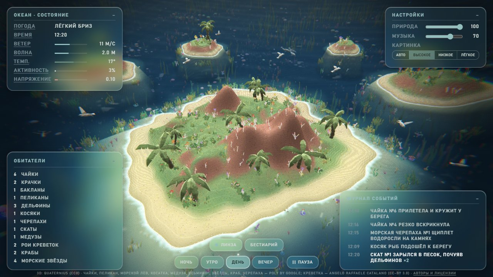
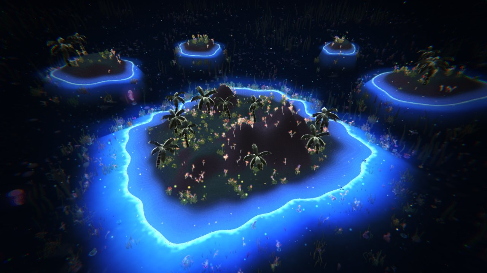
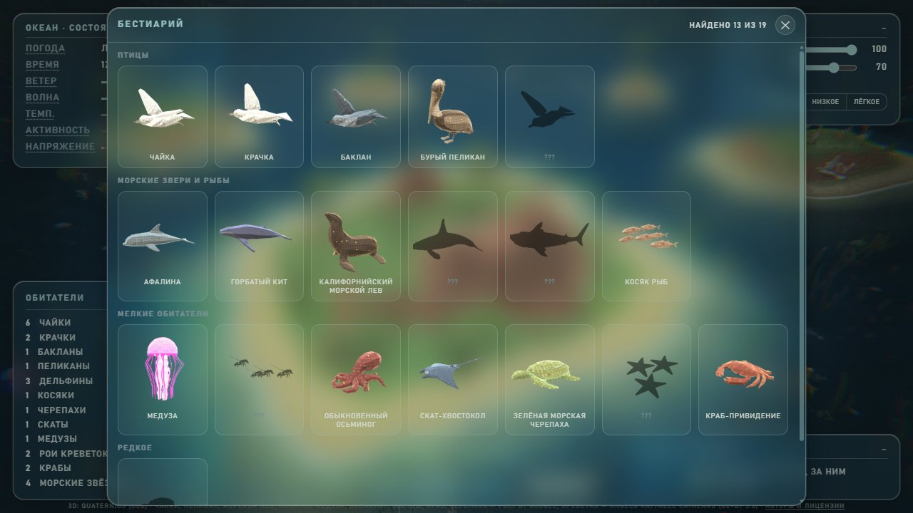

# Abyssonata

Живой океан в браузере: остров, риф и их обитатели — чайки, крачки, бакланы, пеликаны, альбатрос, дельфины, киты,
косатки, акула, морские львы, черепахи, скаты, осьминоги, медузы, креветки, крабы. Каждое существо — агент со своим
поведением (по открытым источникам — см. [BEHAVIOR.md](BEHAVIOR.md)); погода, день и ночь меняются сами, звук и
картинка идут от одного и того же мира.

Вдохновлено murmur.living.



**Открыть:** https://warycarpert12.github.io/abyssonata/ → «Войти в океан» (лучше в наушниках).

**Android:** [APK — последний выпуск](https://github.com/Warycarpert12/abyssonata/releases/latest) (файл `Abyssonata.apk`) — всё внутри,
интернет не нужен (при установке телефон попросит разрешить установку из этого источника).

<p> </p>

## Управление

- Перетаскивание — поворот камеры, колесо мыши или два пальца — приближение.
- Пробел или кнопка «Пауза» — пауза (мир и звук стоят).
- Двойной клик или двойное касание по зверю — камера следит за ним; Esc или ✕ — отпустить. Нажатие на строку
  «Обитателей» или на запись журнала — камера летит к этому зверю.
- «Бестиарий» — карточки встреченных видов; вид отмечается, когда на него навели курсор, выбрали или следили за ним.
  Пока бестиарий открыт, мир на паузе.
- «Ночь», «Утро», «День», «Вечер» — время суток.
- «Настройки» — громкость «Природа» и «Музыка», качество картинки: «Авто» (само снижается, если устройство не
  успевает), «Высокое», «Низкое», «Лёгкое» (для устройств с малой памятью).
- «Линза» (на ПК) — эффект линзы под курсором на панелях.

## Как устроено

Мир — симуляция (`web/sim.js`, `web/agents.js`): погода, волны, сутки и существа-агенты, которые прилетают,
охотятся, перекликаются и уходят. Каждый кадр мир делает шаг и выдаёт один поток — состояние и события («чайка
прилетела», «кит выдохнул»). Этот поток получают и картинка (`web/visual.js`, three.js), и звук (`web/audio.js`,
`web/music.js`, Web Audio), поэтому то, что видно, и то, что слышно, всегда совпадает; звук события идёт с той
стороны экрана, где его видно. Музыка процедурная — по погоде и времени суток. Проект начинался как прототип на
Python и SuperCollider и затем целиком перенесён в браузер: сервер не нужен, мир считается у каждого зрителя свой.

## Запуск локально

Нужен Python 3:

```
git clone https://github.com/Warycarpert12/abyssonata.git
cd abyssonata
python build_site.py
python -m http.server 8000 -d _site
```

Затем открыть http://localhost:8000/. `build_site.py` собирает в `_site/` страницу, сжатые записи и их список
(на GitHub сайт собирается и публикуется сам — `.github/workflows/pages.yml`). Открыть `web/index.html` прямо из
папки не получится: модули и записи браузер грузит только с сервера.

Проверки: баланс мира — `node docs/v22/checks/move_check_split.mjs <web эталона> web`, публикуемый текст —
`node tools/check_publish.mjs --all`. Отчёты по версиям — в `docs/`.

## Чем сделано

three.js (картинка), Web Audio API (звук), GitHub Pages (сайт), Capacitor (APK). Код написан с помощью Claude Code —
ИИ-ассистента для программирования; замысел, решения и проверка — автора.

Автор — waryc ([Warycarpert12](https://github.com/Warycarpert12)).

## Лицензия

Код — [MIT](LICENSE), © 2026 waryc: можно использовать, менять и распространять с указанием
авторства. Сторонние материалы — со своими лицензиями, полный список с авторами и источниками — [THIRD_PARTY.md](THIRD_PARTY.md)
(на сайте — ссылка «Авторы и лицензии»):
- звуки — CC0 1.0 / Public domain (Freesound, Wikimedia Commons, BigSoundBank; авторы — `samples_mp3/*/CREDITS.txt`);
- 3D-модели — CC0 1.0 (Quaternius) и CC-BY 3.0 (Poly by Google, angelo raffaele Catalano — с обязательным указанием
  автора; `web/models/CREDITS.txt`);
- three.js — MIT.
